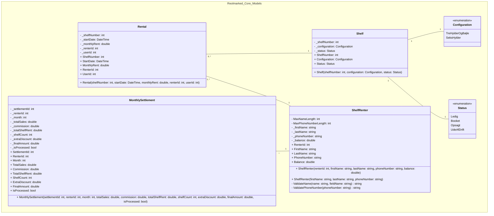

# Reolmarked



```mermaid
# Reolmarked - Arkitektur DCD (Rental Eksempel)

Dette diagram viser et komplet eksempel på tværs af lagene (Modellag, Repository / Data Access og Præsentation / ViewModel) med fokus på **Rental**-domænet.

```mermaid
classDiagram
    namespace Reolmarked_Core_Models {
        class Rental {
            - _shelfNumber: int
            - _startDate: DateTime
            - _monthlyRent: double
            - _renterId: int
            - _userId: int
            + ShelfNumber: int
            + StartDate: DateTime
            + MonthlyRent: double
            + RenterId: int
            + UserId: int
            + Rental(shelfNumber: int, startDate: DateTime, monthlyRent: double, renterId: int, userId: int)
        }
    }

    namespace Reolmarked_Core_Repositories {
        class IRentalRepository {
            <<interface>>
            + Add(rental: Rental) void
            + Update(rental: Rental) void
            + Delete(shelfNumber: int) void
            + GetAll() List~Rental~
            + GetByShelfNumber(shelfNumber: int) Rental
            + GetByRenterId(renterId: int) List~Rental~
        }

        class RentalRepository {
            - _connectionString: string
            + RentalRepository()
            + Add(rental: Rental) void
            + Update(rental: Rental) void
            + Delete(shelfNumber: int) void
            + GetAll() List~Rental~
            + GetByShelfNumber(shelfNumber: int) Rental
            + GetByRenterId(renterId: int) List~Rental~
            - MapRental(reader: SqlDataReader) Rental
        }
    }

    namespace Reolmarked_UI_ViewModels {
        class RentalViewModel {
            - _rentalRepository: IRentalRepository
            - _selectedShelf: Shelf?
            - _startDate: DateTime
            + Shelves: ObservableCollection~Shelf~
            + SelectedShelf: Shelf?
            + StartDate: DateTime
            + BookCommand: RelayCommand
            + ConfirmBookingCommand: RelayCommand
            + RentalViewModel(rentalRepository: IRentalRepository, shelfRepository: IShelfRepository, renterRepository: IShelfRenterRepository)
        }

        class ManageRentalViewModel {
            - _rentalRepository: IRentalRepository
            - _selectedRental: Rental?
            + Rentals: ObservableCollection~Rental~
            + SelectedRental: Rental?
            + EndRentalCommand: RelayCommand
            + ManageRentalViewModel(rentalRepository: IRentalRepository, shelfRepository: IShelfRepository, renterRepository: IShelfRenterRepository)
        }
    }

    IRentalRepository <|.. RentalRepository
    RentalViewModel "1" -- "1" IRentalRepository : afhænger af (DI)
    ManageRentalViewModel "1" -- "1" IRentalRepository : afhænger af (DI)
    RentalViewModel "1" o-- "*" Rental : håndterer/opretter
    ManageRentalViewModel "1" o-- "*" Rental : viser/administrerer
    RentalRepository "1" o-- "*" Rental : henter/mapper
```


