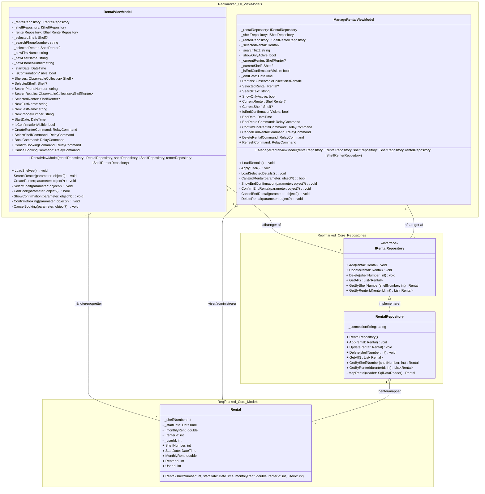

# Reolmarked

# Reolmarked - Design Class Diagrams (DCD)

Dette dokument indeholder projektets to versioner af DCD'et i overensstemmelse med projektkravet: Én model der viser sporbarhed til domænemodellen, og én model der viser eksempler på arkitekturens lag-samspil.

## 1. DCD med sporbarhed til DM (Modellaget)
Dette diagram viser klasserne og enumerations i domæne-/modellaget[cite: 1].

# Reolmarked - Arkitektur DCD (Rental Eksempel)

Dette diagram viser et komplet eksempel på tværs af lagene (Modellag, Repository / Data Access og Præsentation / ViewModel) med fokus på **Rental**-domænet.

